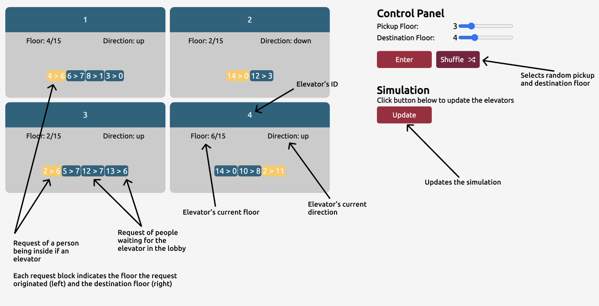

# Elevator System
Web app implementation of an elevator system using React and TypeScript. The system provides a user interface (UI) for inspecting the state of elevators and dispatching pickup orders. The system is designed to handle any number of elevators and floors, which can be configured in the config file.

The system utilizes the Shortest Seek Time First (SSTF) algorithm to handle pickup orders. The algorithm assignes orders to the designated elevator based on various criteria - minimum seek time being one of them.

Additionally, each elevator implements the LOOK algorithm, an improvement of the SCAN algorithm, to efficiently traverse the floors.

More details on the implementation in the following sections.

## User interface
Graphical user interface allows one to interact with the simulator seamlessly. UI consists of a list of elevator cards representing every elevator's state on the left and a Control Panel on the right.
Control Panel allows for entering pickup orders. 


## Elevator System algorithm
Each created pickup order is assigned to the most suitable elevator. Selection algorithm follows the following criteria:
- The algorithm first selects idle elevators, if available.
- The algorithm selects the elevators closest to the floor where the pickup order originates from.
- Among the eligible elevators, the algorithm chooses the one that is least occupied, i.e., the elevator with the fewest active orders.

## Elevator algorithm
Elevator algorithm defines behavior of the elevator. It follows the following rules:
1. The elevator's moving direction can be one of three values: "idle", "up", or "down".
2. The elevator's <b>queue</b> contains all people's requests assigned to the elevator. Each request has information on pickup and destination floor, person's current location (lobby or elevator) and direction of the travel.
3. If the elevator is idle, it checks if there are any requests in the queue.
4. If the queue is empty, the elevator remains idle.
5. If the queue is non-empty, a new direction is calculated based on the current floor of the elevator and the first order in the queue.
6. The elevator travels floors one by one until it reaches the <b>furthest</b> floor in the queue. The furthest floor is the maximum value in the queue if the elevator is going "up," and the minimum value if it is going "down".
7. When traveling in the defined direction, the 
elevator lets people in, on each visited floor, if they requested to travel in the dirrection equal to the current direction af the elevator. For example, if the elevator is going down to 2nd floor, it will not stop on the 3rd floor where someone requested to go to the 10th floor.
8. Elevator has body limit. People are not served if the limit would be exceeded - people are left waiting in the lobby.

## Config file
One can adjust the appliaction by changing constants in the config file located in `src/config/config.ts`

```
export const TOTAL_FLOORS = 15
export const NUMBER_OF_ELEVATORS = 4
export const ELEVATOR_BODY_LIMIT = 3
```

## How to start?
1. `git clone ...` the repository to any location,
2. run `npm install` inside repository directory in order to install required dependencies,
3. run `npm run dev` to start dev server and enter address printed out in the console
